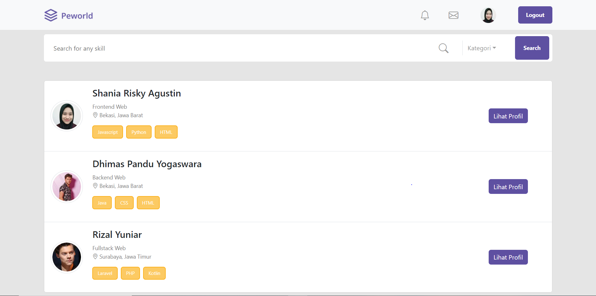
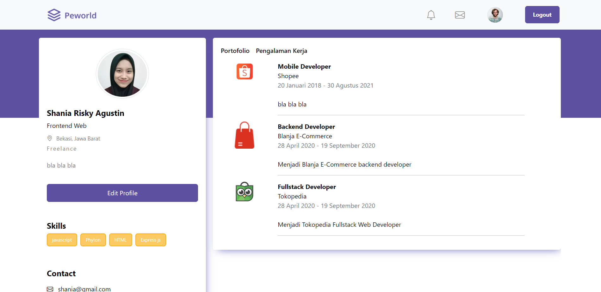

<br />
<p align="center">

  <h3 align="center">HireJob Application</h3>
  <p align="center">
    <image align="center" width="100" src='/src/assets/image/Logo_Purple.png' />
  </p>
  <p align="center">
    <a href="https://hirejob-fe-snowy.vercel.app/">View Demo</a>
  </p>
</p>

<!-- TABLE OF CONTENTS -->

## Table of Contents

- [About the Project](#about-the-project)
  - [Project Structure](#project-structure)
  - [Screenshots](#screenshots)
  - [Package Modules](#package-modules)
- [Getting Started](#getting-started)
  - [Prerequisites](#prerequisites)
  - [Installation](#installation)
- [Contributing](#contributing)
- [Related Project](#related-project)
- [Contact](#contact)

<!-- ABOUT THE PROJECT -->

## About The Project

Peworld Hirejob is a web-based application, where there are two users, workers and companies. Workers can share their profile, skills, portfolio and experience. Companies can hire workers. This app is built using NextJS and ExpressJS.

### Project Structure

```
|── hirejob
   |── public          # Public Assets
   |── screenshot      # Screenshots of the application
   |── src             # Project source code
       |── assets      # Application assets
       |── components  # Application components
       |── pages       # Pages source code
       |── redux       # State management
       |── styles      # Application CSS
   |── .env            # Environment variables
   |── .gitignore      # Files that should be ignored
   |── README.md       # Readme
```

### Screenshots

<details>
  <summary>
    Login worker
  </summary>

</details>

<details>
  <summary>
    Register worker
  </summary>

</details>

<details>
  <summary>
    Login Company
  </summary>

</details>

<details>
  <summary>
    Register Company
  </summary>

</details>

<details>
  <summary>
    Reset Password Page
  </summary>

</details>

<details>
  <summary>
    Confirm Password
  </summary>

</details>

<details>
  <summary>
    Confirm Password Login
  </summary>

</details>

<details>
  <summary>
    Landing Page
  </summary>

</details>

<details>
  <summary>
    Home
  </summary>

</details>

<details>
  <summary>
    Profile Worker Portofolio
  </summary>

</details>

<details>
  <summary>
    Profile Worker Experience
  </summary>

</details>

<details>
  <summary>
    Edit Profile Worker
  </summary>

</details>

<details>
  <summary>
    Company Profile
  </summary>

</details>

### Package Modules

Below are lists of modules used in this application:

- [React JS](https://reactjs.org/)
- [Redux](https://redux.js.org/)
- [Bootstrap](https://getbootstrap.com/)
- [Axios](https://axios-http.com/)
- [Dotenv](https://www.npmjs.com/package/dotenv)
- [SweetAlert2](https://sweetalert2.github.io/)

<!-- GETTING STARTED -->

## Getting Started

### Prerequisites

This is an example of things you need to use the application and how to install them.

- [node.js](https://nodejs.org/en/download/)

### Installation

1. Clone the repo

```sh
git clone https://github.com/Shaniara28/hirejob_fe
```

2. Install NPM packages

```sh
npm install
```

3. Add .env file at your frontend root folder project, and add the following

```sh
REACT_APP_BACKEND_URL = your_api_url

```

<!-- CONTRIBUTING -->

## Contributing

Contributions are what make the open source community such an amazing place to be learn, inspire, and create. Any contributions you make are **greatly appreciated**.

1. Fork the Project
2. Create your Feature Branch (`git checkout -b your/branch`)
3. Commit your Changes (`git commit -m 'Add some AmazingFeature'`)
4. Push to the Branch (`git push origin feature/yourbranch`)
5. Open a Pull Request

<!-- Related Project -->

## Related Project

:rocket: [`Backend`](https://github.com/Shaniara28/hirejob_be)

:rocket: [`Frontend`](https://github.com/Shaniara28/hirejob_fe)

:rocket: [`Demo`](https://hirejob-fe-snowy.vercel.app/)

<!-- CONTACT -->

## Contact

My Email : saniarizkiagustin@gmail.com
